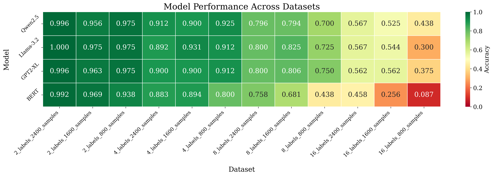

Fine tuning LLM models for text classification
===============================================

AUTHORS: Meysam Motaharfar 

# Table of Contents
1. [Project Overview](#Project-Overview)
2. [Dataset](#Dataset-Source-And-Overview)
3. [Key Tools & Libraries](#key-Tools-&-Libraries)
4. [Models](#Models)
5. [Fine-Tuning Configuration and Limitations](#Fine-Tuning-Configuration-and-Limitations)
6. [Evaluation Metric](#Evaluation-Metric)
7. [Results & Summary](#Results-&-Summary)

# Project Overview

This project investigates the performance of several large language models (LLMs) on multi-class emotion classification tasks using subsets of the GoEmotions dataset. The study evaluates how model performance varies based on:

The number of emotion labels (2, 4, 8, or 16)

The number of training samples (800, 1600, or 2400)

The choice of pre-trained language model

The goal is to understand model generalization in low- and mid-resource settings for emotion classification.

# Dataset

The base dataset is GoEmotions — a human-annotated corpus of 58k Reddit comments labeled with 27 emotion categories.

For this project:

12 balanced subsets were created

Each subset varies by:

Number of label classes: 2, 4, 8, or 16

Number of training samples per class: 800, 1600, or 2400

This design forms a systematic evaluation grid across varying classification complexities and dataset sizes.

# Key Tools & Libraries

**Hugging Face Transformers** – for model loading, tokenization, and training

**PEFT (LoRA)** – for parameter-efficient fine-tuning

**Hugging Face Datasets** – for loading and preprocessing the dataset

**PyTorch** – as the deep learning backend

**Evaluate** – for computing evaluation metrics such as accuracy

# Models

The following pre-trained LLMs were fine-tuned for each dataset configuration:

Qwen 2.5

LLaMA 3.2

GPT-2 XL

Gemma 3

All models were trained using supervised learning with appropriate classification heads. Training incorporated early stopping based on validation accuracy to avoid overfitting.

# Fine-Tuning Configuration and Limitations

The models were fine-tuned on emotion classification datasets with varying label complexities (2, 4, 8, and 16 labels) and data sizes (800, 1600, and 2400 samples) under the following configuration:

Quantization: 4-bit quantized models using the BitsAndBytes library were employed to significantly reduce memory consumption and accelerate training.

Adapter Tuning: Low-Rank Adaptation (LoRA) was used for parameter-efficient fine-tuning. Model-specific attention modules (e.g., q_proj, v_proj, c_attn, or query/value) were targeted based on model architecture.

Training Regimen:

Optimizer: adamw_bnb_8bit

Batch size: 4 per device

Learning rate: 1e-4 with cosine scheduler

Epochs: 5

Gradient accumulation: 1 step

Mixed precision: bf16 used (with fallback to fp16=False)

Early stopping: Patience of 10 evaluation steps

**Note:** Fine-tuning was conducted under limited compute resources, with a single GPU and memory-optimized configurations (e.g., 4-bit quantization and adapter-based tuning). These constraints limited both the model size (to ≤2B parameters) and the maximum batch size.

Moreover, due to dataset limitations:

Balanced subsets were used, and each training regime had an equal number of samples per label.

No external data augmentation or unsupervised pretraining was applied.

Evaluation was performed on stratified splits with fixed seeds to ensure consistency. Accuracy, precision, recall, and F1 score were tracked throughout the training using Trainer's logging.

# Evaluation Metric

The primary evaluation metric is accuracy, computed on a held-out validation set for each configuration. It reflects the model’s ability to correctly classify text across varying label granularities.

# Results & Summary

The fine-tuning experiments reveal consistent trends in model performance across different classification complexities and dataset sizes.

**Effect of Label Complexity**

As expected, accuracy decreases with increasing label complexity:

For 2-class classification, all models achieve very high accuracy, with LLaMA-3.2 reaching perfect performance (100%) at 2400 samples.

Performance drops steadily as the number of labels increases, especially from 8 to 16 labels.

For 16-label classification, accuracy falls below 60% for all models—even at 2400 samples—highlighting the difficulty of fine-grained emotion classification with limited supervision.

**Effect of Training Data Size**

Across all models, increasing the number of training samples improves performance:

For instance, Qwen 2.5 improves from 43.75% (800 samples) to 56.67% (2400 samples) in the 16-label task.

Gains are more substantial in high-label scenarios where more data mitigates the complexity.

**Model Comparison**

LLaMA-3.2 and Qwen 2.5 demonstrate the best overall performance and robustness across the board:

In the 4-label, 1600-sample setting, LLaMA-3.2 achieves 93.13%, the highest accuracy for this configuration.

In low-data regimes like 800 samples with 16 labels, Qwen 2.5 maintains a reasonable 43.75%, outperforming LLaMA-3.2 (30.00%) and BERT (8.75%).

GPT-2 XL remains competitive for simpler tasks but lags behind in complex, low-resource settings.

BERT, while still effective in low-label tasks (e.g., 99.17% in 2-label, 2400-sample), performs significantly worse in high-label, low-resource scenarios—dropping to 8.75% in the 16-label, 800-sample case.

A heatmap of model performance across datasets reveals the relative robustness of models under varying levels of complexity and training data.

