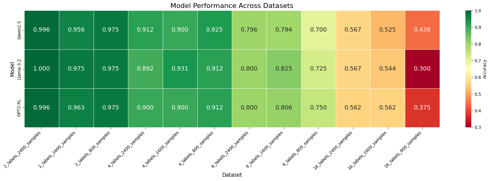

Fine tuning LLM for text classification
===============================================

AUTHORS: Meysam Motaharfar 

# Table of Contents
1. [Project Overview](#Project-Overview)
3. [Dataset](#Dataset-Source-And-Overview)
4. [Tools Used](#Tools-Used)
5. [Key Questions](#Key-Questions)
6. [Key Insights](#Key-Insights)
7. [Conclusions](#Conclusions)

# Project Overview

The goal of this project is to evaluate the performance of several large language models (LLMs) on multi-class text classification tasks using subsets of the GoEmotions dataset. The study explores how model performance varies with:

The number of emotion labels (2, 4, 8, 16),

The number of training samples per dataset (800, 1600, 2400), and

The choice of pre-trained language models.

# Dataset

The base dataset is GoEmotions — a human-annotated dataset of 58k Reddit comments labeled for 27 emotion categories.
For this project:

A total of 12 balanced subsets were created.

Each subset represents a specific configuration of:

Label classes: 2, 4, 8, or 16

Training samples: 800, 1600, or 2400 samples

This results in a systematic grid of classification tasks to evaluate model generalization in low- to mid-resource regimes.

